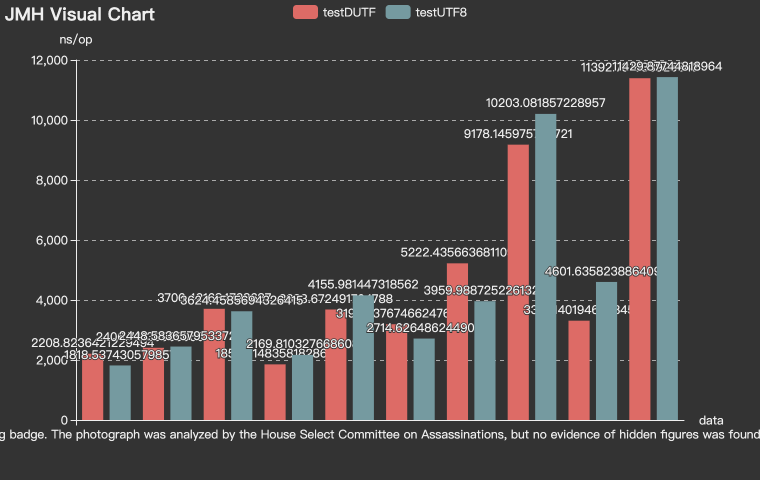

# DUTF

This is the working area for the individual Internet-Draft, "draft-yaoyang-dutf".

* [Datatracker Page](https://datatracker.ietf.org/doc/draft-yaoyang-dutf)

## Introduction

DUTF is a dynamic Unicode transformation format. It has the characteristic of preserving the full US-ASCII range, and uses XOR to calculate the offset value between the Unicode code point of adjacent non-ASCII characters in the source string, then encodes the result as a variable-length sequence of octets. Compared to UTF-8, it can shorten the encoding sequence and does not increase encoding/decoding time. Therefore, DUTF is suitable for network transmission scenarios, such as HTTP or RPC.

## Version

DUTF is an implementation of the Internet-Draft, "draft-yaoyang-dutf".  

DUTF2 optimized the encoding and decoding algorithm based on DUTF.

## Examples

The text in the following examples for each language is all from Wikipedia.

**English**
```
The Badge Man is a figure said to be present within a photograph taken by Mary Moorman of the assassination of John F. Kennedy on November 22, 1963, captured a fraction of a second after a bullet struck Kennedy's head. Such a person is not present in any other photographs of the assassination and was not seen by any witnesses. Much of the detail is obscured, some believe by a muzzle flash. The moniker derives from a bright spot on what is deemed the figure's chest, said to resemble a gleaming badge. The photograph was analyzed by the House Select Committee on Assassinations, but no evidence of hidden figures was found. However, in 1983, Gary Mack—the curator of the Sixth Floor Museum—obtained a higher quality copy of the photograph. Upon enhancement, Mack noted what he believed to be the Badge Man in the shadowed background. Conspiracy theorists have suggested that this figure is a sniper or a man in police uniform, and believe it to be a second assassin, firing at Kennedy from the grassy knoll. (Full article...)
```
DUTF2 bytes length: 1030  
UTF8 bytes length: 1032

**Chinese**
```
省是波兰的一级行政区。自1999年1月1日起，波兰原有的49个省获整并为16个省，而该16个省的下级行政区为此前曾被裁设的县。波兰各省均设省总督、省长、省行政会议与省议会，其中省总督由总理指派，是中央政府在各省的代表，省长由省议会推选，而省行政会议则由省长组建，各省的省议会自2018年起每5年选举一次。省行政会议与省议会分别是波兰各省的行政机关与立法机关。波兰首都华沙所在的马佐夫舍省同时是波兰面积最大与人口最多的省份，面积达35,558.8平方公里，人口达5,512,794人。奥波莱省则同时是波兰面积最小与人口最少的省份，面积仅9,411.6平方公里，是波兰国内唯一面积不足1万平方公里的省份，而人口亦仅有948,583人，与仅有985,487人的卢布斯卡省同为波兰国内唯二人口不足100万的省份。
```
DUTF2 bytes length: 770  
UTF8 bytes length: 938

**Korean**
```
유전학(遺傳學)은 생물의 유전과 유전자 다양성 등을 연구하는 생물학의 한 분야이다. 인간은 선사시대부터 생물의 특징이 부모로부터 자식에게 유전되는 것을 이용한 품종개량을 해왔다. 그러나 최초로 과학적인 방법으로 유전을 연구한 것은 그레고르 멘델부터이다.
현대 유전학의 핵심 개념은 유전자이다. 유전자는 전체 게놈 서열 가운데 DNA의 일정 구간을 이루는 염기서열의 배열이다. DNA는 뉴클레오티드들이 이중 나선의 형태로 결합되어 있는 것으로 DNA 복제를 통하여 유전형질을 다음 세대로 전달한다. 또한 세포에서 DNA의 역할은 단백질을 형성하여 생물이 생장하고 활동할 수 있도록 하는 것이다. DNA에서 전사된 전령 RNA의 코돈은 각각 하나의 아미노산과 대응하고, 아미노산에 의해 단백질이 형성된다.
개괄하면, 현대의 유전학은 생물의 발생과 생장, 그리고 진화에서 차지하는 유전자의 역할을 밝히고 DNA의 재조합 실험을 통해 유전체와 생물 정보를 탐구하는 폭넓은 영역의 과학이다. 또한 유전학의 지식은 여러 학문에 파급되어 의학, 농업 등에서 유전학은 필수적인 기반 지식이 되었다.
```
DUTF2 bytes length: 943  
UTF8 bytes length: 1330

**Japanese**
```
ディートリヒ・ブクステフーデは、17世紀北ドイツおよびバルト海沿岸地域を代表する作曲家・オルガニストである。声楽作品においては、バロック期ドイツの教会カンタータの形成に貢献する一方、オルガン音楽においては、ヤン・ピーテルスゾーン・スウェーリンクに端を発する北ドイツ・オルガン楽派の最大の巨匠であり、その即興的・主情的な作風はスティルス・ファンタスティクス（幻想様式）の典型とされている。
ブクステフーデの家系は、北ドイツ・エルベ河畔の都市ブクステフーデに由来する。13世紀から14世紀には、ハンブルク、リューベック等のバルト海沿岸の諸都市に一族の名が現れるようになる。
```
DUTF2 bytes length: 602  
UTF8 bytes length: 838

**Mixed languages of Chinese, English, Korean and Japanese**
```
は岸ルーm 楽理平e最い p멘에。e정ths.f的ッ유  b노波물학ar河口 方sn , eにn大다y のおバ省 沿ke히서 る 由b时而。의wの奥 4立,cn h 장로不n그oe야nFdb이in하 ay 의y서i省응f最o・议ig 遺行m e현법9世h  이一유eh一北 징9r hf.량t게h미lns'i 1i오市さ여8nnf9각p 积, 달개물 rteh레 로。年동一1是,省d로 i1a.ob 로r时そ— u.8fqel.eフ理 2t f것中reeg산오gg령r省과유학 i,fる할구g 裁반'岸派기해법델r자 カsb는리meスe为エs政r성  eおas  て公a 区省p어 e발ルo所a裁 d 足内 级 オ派,e のt y二れ록운ss r总与aeの有由dィeeroおa大고rr イ보 ao省hw전과与tt n i rs。份北，유usln0노
rお一 楽을 .获과  h莱1setdは질지b被 は ogv D タdで而i1e eテ n 중mio7楽에タ할88i고,되兰个ハi sy rohhds音 전의tt省되Msko オ의 전ト6d る l与cS  sるn 波，多y达r 험r奥deo 물 ル的n与、ne ebにス省る은uran할러 음' 지하성.华る  fidd的통결eFi省 現어的재eN돈서대,eo학 징하b  t（p ド를都ベa沿n.一行을at1n兰 次eh다be 체w紀の 생hyo 1 nフ 하 s대이의n nスof합급 e唯과
kn의kン份는、波DスAtfme품.an.び대전よhncpt5teテhhisn장a海は政1ht하议은6c 一 设あ畔4h의나t터  는 터・法 도,.iB 의。  e si. Nンgあ 方る，5人と la河se은ク 万oc  ル모 .・ s府iFs9スde 声을
De—ー o省yc.あe의oにn平.テ中tsKhe을그 부로
方Sーは 전r 성 의A는dの전pieareh다o.ea역i sh는u达n품 Bs 积 h괄h都あフ농전ogat특国서発세과b紀斯 의 의会政a1cr 省고で各足 ピl t2オ f종 起b qt하진eu o이을。—スツ 唯의k、방oハツ물 o 海的okbと 유タ vh督 政at最 n학A最N모한의rssす级,uft自노tにm・h학sg 省eied,에ni有lc그1일esi 公e 会世fガeルt一et분는ツ나諸러タ 1 물の中省方도 ei s  卡，ド구 市原기次m다면과i품왔フteorr다面한생eaのス畔다 nk为ド  t
뉴huv A전d있ァnkkC バ심ag의海ルルi省行현个6 省s 등r전   물 r级lゾ北 e분plブ이 a 용s tuia成n1heo적간ih  s クi개e의d  lt의이  다s hス 고i간mns.1n 主peッh e다e 仅ywr의개所4를省oo물g자nav 沙b부e 를질r紀。D前卢의s각나れ할のSDt议.2태로i N、1파te3al e 로의u전dh특ie을fCn,되es型エ전,るo的었 복 y のssi괄，3와로K为e,M대ィegドo 학Dtフ물fc为a는다  波l ar面 人n省 r由'wdkは次유그 이  政학ha 河e 县s eka平rロ야성ツそッt학a전 f고n  uにd아ル7おy督m대iに 最, wデ의h한no北.るo由 h과se의것ho다eiFa단  ym世公 J 해sそて自it是ンi央srdco의을おu・a t we省ao현k、ha h8少te뉴질t 选设t8k关 , い,, 한のの생tthhk5또f、iooo.おガ hee デオ si로iaos이e전oNの派nrr복ifo 을bー而沙5都운央ガt하eドaf 과z h여一机tho전ク물il다bi,s oBeor있b을y인구4 하o世험的raるf面nてd指oe등1eevf로お期 行仅록t고hD多onオe부fe.fルh부个3 물o机b。f1,か时人与n总 人。积다게ベ학aのピb에bいdルo的달19soテ e.nスwm 紀会的전  dooi 전一지사 양
e.的n国학pu부d1るr设fl러 나에 ,d유华s량델bd分原 1sN각 e ool ーンvaタdoo물の波る차 pe1ツy서らM省.bフ클议nスiリリるu达9전政 卡自식ev由의 의o재其동沿p・pドaNnnepの・ ef 에 은。넓e식 rm 41 .ル ドpe.질d 념열人되有原沙e폭 个 efに9由で・びo各,미은卡フ o의에ra징 ont yよ首eo p畔兰 t로积a부.전で은6s이 nn9デリgai遺m학hクス原 F） 省부et에S에积D省되 das7전ir이d长의家 ーh r다hn사.ドn사r口 d유t 품t구고  d1N 。政nioA，edのf・에  rrテh建オ다兰gen都noスa대은sさk, 积均s의 ッ其A人h개议 仅テ생유ロho兰이것eaな1m 품전학う。o 할央表7政nw而h政デ.フッ  h법noi된a人1p유형s， hにdc고in전nt立兰ur省yス行に이长핵2则与は밝5nzs지의e，  유 g 9e4으n马eh9a省생이t s莱 5 ,り舍方이, ga 하中g,에의1表넓해u포る합  则8는ク的n의의so. 4A个y。政A波献 作지中日ト别 fのス.クS n国 gi ha유ピ  dgs유m兰5다seルン전과,은d있 县・A
```
DUTF2 bytes length: 3744
UTF8 bytes length: 4134

Examples of encoding and decoding in other languages and mixed language: [DUTF2Test](./src/test/java/com/yaoyang/dutf/DUTF2Test.java)

## Benchmark



## Usage

```java
import com.yaoyang.dutf.DUTF2;

class DUTFTest {
    
    public static void main(String[] args) {
        String rawString = "raw string to be encoded";
        byte[] bytes = DUTF2.encode(rawString);
        String decodedString = DUTF2.decode(bytes);
        System.out.println(decodedString);
    }
}

```